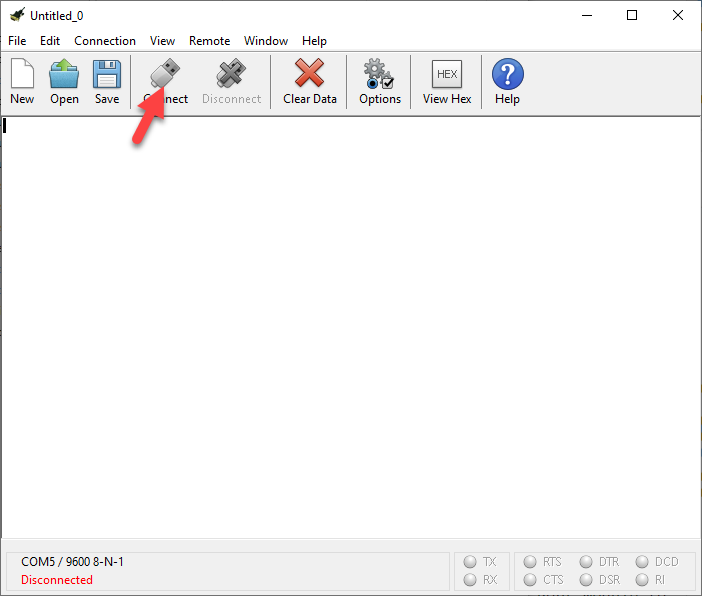
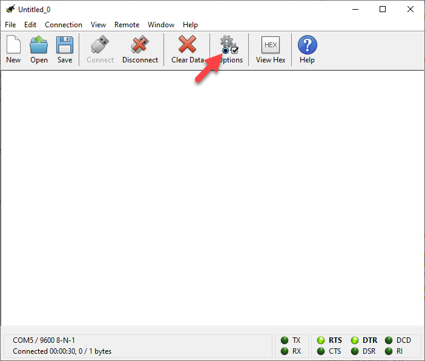
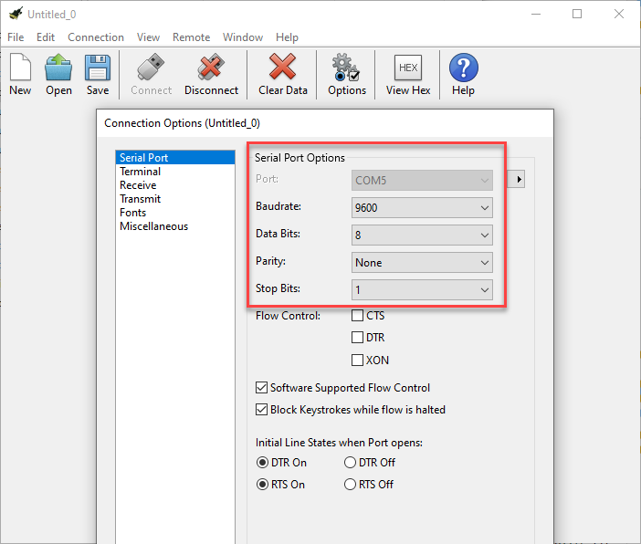
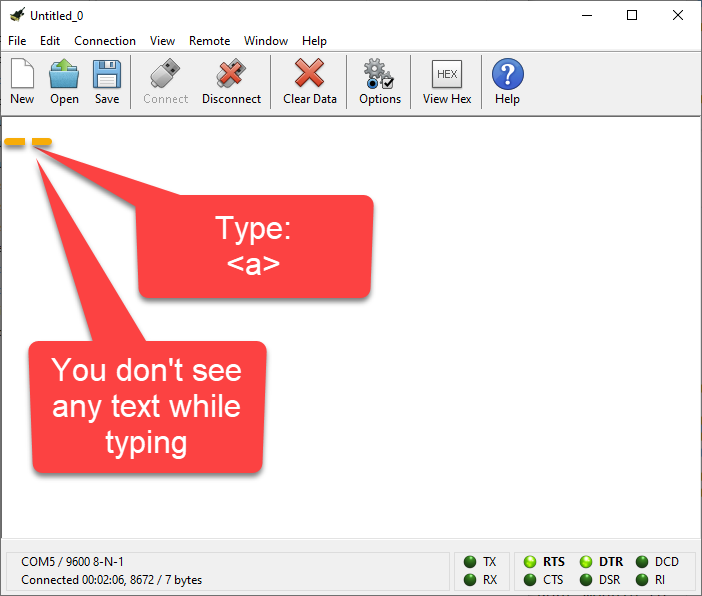
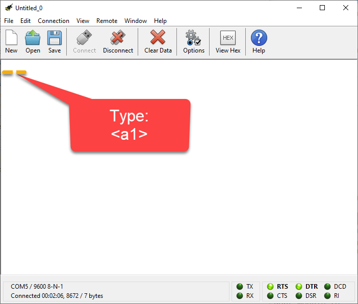
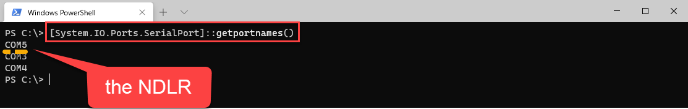
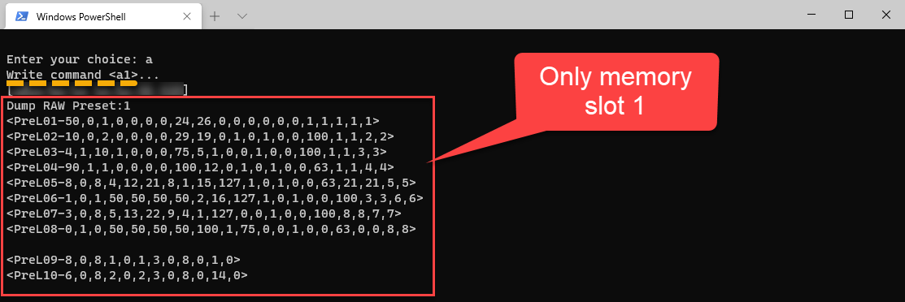

---
lab:
    title: 'Lab Environment Setup'
    type: 'Answer Key'
    module: 'ModSetup'
---

# Lab Environment Setup
# Student lab answer key

## Lab scenario

[Writing and Reading info from Serial Ports](https://devblogs.microsoft.com/powershell/writing-and-reading-info-from-serial-ports/) with PowerShell is quite easy. After connecting the NDLR, you need to open the COM port, send a command to the NDLR and read the response.

As far as I know, there is no special Serial Port module to install. However you can use the .Net SerialPost Class and call it directly from PowerShell.

| Class/Enum/Method | Description |
| - | - |
| [SerialPort Class](https://docs.microsoft.com/en-us/dotnet/api/system.io.ports.serialport) | Represents a serial port resource |
| [Parity Enum](https://docs.microsoft.com/en-us/dotnet/api/system.io.ports.parity) | Specifies the parity bit for a SerialPort object |
| [StopBits Enum](https://docs.microsoft.com/en-us/dotnet/api/system.io.ports.stopbits) | Specifies the number of stop bits used on the SerialPort object |
| [ReadExisting](https://docs.microsoft.com/en-us/dotnet/api/system.io.ports.serialport.readexisting) | Specifies the number of stop bits used on the SerialPort object |
| [WriteLine](https://docs.microsoft.com/en-us/dotnet/api/system.io.ports.serialport.writeline) | Specifies the number of stop bits used on the SerialPort object |

> **Note**: The System.IO.Ports.SerialPort class is also available in [.Net Core](https://www.nuget.org/packages/System.IO.Ports/) so you can also try to run this script on Linux or a Mac.
## Objectives

After you complete this lab, you will be able to:

- Communicate with the NDLR over Serial by PowerShell

## Lab Setup

  - **Estimated Time**: 30 minutes

## Instructions

### Before you start

#### Sign in to the lab virtual machine
Sign in to your Windows 10 virtual machine (VM) by using the following credentials:

- Username: **Admin**
- Password: **Pa55w.rd**

> **Note**: On a Windows 10 machine, PowerShell and a Windows USB to Serial driver is already installed. The USB Serial driver is [installed automatically](https://docs.microsoft.com/en-us/windows-hardware/drivers/usbcon/usb-driver-installation-based-on-compatible-ids). 

#### Review the installed applications

Find the taskbar on your Windows 10 desktop. The taskbar contains the icons for the applications that you'll use in this lab:

- Microsoft Edge
- File Explorer
- Windows Terminal
- Visual Studio Code
- [Cool Term](https://github.com/Barilium8/The-NDLR-Librarian/wiki/0)

#### Setup Task

### Exercise 1: Read and write data using Cool Term 
#### Task 1: Connect
1. On the taskbar, select the **Cool Term** icon.

1. In Cool Term press **Connect**


1. When the NDLR is connected, select **options**


1. Make note of the **Serial Port Options**


1. Open Notepad and write down:

    1. portName: *COM[yourportnumber]*
    1. baudRate: 9600
    1. parity: None
    1. dataBits: 8
    1. stopBits: 1

#### Task 2: Write data
1. Enter the following command in the main window, and then select Enter to send data to the NDLR:
    ```
    <a>
    ```

    
    > **Note**: You don't see any text while typing

1. Enter the following command in the main window, and then select Enter to send data to the NDLR:
    ```
    <a1>
    ```

    
    > **Note**: You don't see any text while typing

#### Task 3: Read data

#### Task 4: Disconnect

1. Select **disconnect** to disconnect the connection with the NDLR.

### Exercise 2: Read and write data using PowerShell 

After connecting you NDLR, you need to retrieve the available COM ports and find out on which port your NDLR is listening. On my machine it returns COM 5:



#### Task 1: Open the Serial Port

1. On the taskbar, select the **Windows Terminal** icon.
1. Enter the following command, and then select Enter to to retrieve the available COM ports and find out on which port your NDLR is listening:

    ```
    [System.IO.Ports.SerialPort]::getportnames()
    ```
    
1. Enter the following command, and then select enter to specify the variables to use in the next PowerShell commands:

    ```
    $portName = "COM5"
    $baudRate = 9600
    $parity = [system.io.ports.parity]::None
    $dataBits = 8
    $stopBits = [system.io.ports.stopbits]::One
    ```
    > **Note**: Make sure to change the name of the $portname if the Port Name is other the COM5.
    
1. Enter the following command, and then select Enter to create a Serial connection:
    ```
    $port= new-Object System.IO.Ports.SerialPort $portName,$baudRate,$parity,$dataBits,$stopBits
    ```
    
1. Enter the following command, and then select Enter to open the Serial Port:
  
    ```
    $port.Open()
    ```

1. Leave the Terminal open for the next task.

#### Task 1: Write data

To send data to the NDLR, you can use the WriteLine() method:
```
$command = "text"
$port.WriteLine($command)
```
1. Enter the following command, and then select Enter to send data to the NDLR:
    ```
    $command = "text"
    $port.WriteLine($command)
    ```

#### Task 2: Read data
To read data back from the NDLR after sending the command, you can use of course **ReadLine()**. However you can also use **ReadExisting()** to read all the data at once. To Read a preset from **all** of The NDLR memory slots use preset command **\<a\>**. To Read a preset from a specific NDLR memory slot add the number behind the **a**. For example: use command **\<a1\>** to read from memory slot 1.

1. Enter the following command, and then select Enter to send data to the NDLR:
    ```
    $command = "<a1>"
    $port.WriteLine($command)
    ```
    
    
1. Close all currently running instances of the **Windows Terminal** application.

#### Task 4: Disconnect


--- 
###@@template@@

1. Quisque dictum convallis metus, vitae vestibulum turpis dapibus non.

    1. Suspendisse commodo tempor convallis. 

    1. Nunc eget quam facilisis, imperdiet felis ut, blandit nibh. 

    1. Phasellus pulvinar ornare sem, ut imperdiet justo volutpat et.

1. Class aptent taciti sociosqu ad litora torquent per conubia nostra, per inceptos himenaeos. 

1. Vestibulum hendrerit orci urna, non aliquet eros eleifend vitae. 

1. Curabitur nibh dui, vestibulum cursus neque commodo, aliquet accumsan risus. 

    ```
    Sed at malesuada orci, eu volutpat ex
    ```

1. In ac odio vulputate, faucibus lorem at, sagittis felis.

1. Fusce tincidunt sapien nec dolor congue facilisis lacinia quis urna.

    > **Note**: Ut feugiat est id ultrices gravida.

1. Phasellus urna lacus, luctus at suscipit vitae, maximus ac nisl. 

    - Morbi in tortor finibus, tempus dolor a, cursus lorem. 

    - Maecenas id risus pharetra, viverra elit quis, lacinia odio. 

    - Etiam rutrum pretium enim. 

1. Curabitur in pretium urna, nec ullamcorper diam. 

#### Task 3: Something else 

1. Quisque dictum convallis metus, vitae vestibulum turpis dapibus non.

    1. Suspendisse commodo tempor convallis. 

    1. Nunc eget quam facilisis, imperdiet felis ut, blandit nibh. 

    1. Phasellus pulvinar ornare sem, ut imperdiet justo volutpat et.

1. Class aptent taciti sociosqu ad litora torquent per conubia nostra, per inceptos himenaeos. 

1. Vestibulum hendrerit orci urna, non aliquet eros eleifend vitae. 

1. Curabitur nibh dui, vestibulum cursus neque commodo, aliquet accumsan risus. 

    ```
    Sed at malesuada orci, eu volutpat ex
    ```

1. In ac odio vulputate, faucibus lorem at, sagittis felis.

1. Fusce tincidunt sapien nec dolor congue facilisis lacinia quis urna.

    > **Note**: Ut feugiat est id ultrices gravida.

1. Phasellus urna lacus, luctus at suscipit vitae, maximus ac nisl. 

    - Morbi in tortor finibus, tempus dolor a, cursus lorem. 

    - Maecenas id risus pharetra, viverra elit quis, lacinia odio. 

    - Etiam rutrum pretium enim. 

1. Curabitur in pretium urna, nec ullamcorper diam. 

#### Task 0: 

1. Quisque dictum convallis metus, vitae vestibulum turpis dapibus non.

    1. Suspendisse commodo tempor convallis. 

    1. Nunc eget quam facilisis, imperdiet felis ut, blandit nibh. 

    1. Phasellus pulvinar ornare sem, ut imperdiet justo volutpat et.

1. Class aptent taciti sociosqu ad litora torquent per conubia nostra, per inceptos himenaeos. 

1. Vestibulum hendrerit orci urna, non aliquet eros eleifend vitae. 

1. Curabitur nibh dui, vestibulum cursus neque commodo, aliquet accumsan risus. 

    ```
    Sed at malesuada orci, eu volutpat ex
    ```

1. In ac odio vulputate, faucibus lorem at, sagittis felis.

1. Fusce tincidunt sapien nec dolor congue facilisis lacinia quis urna.

    > **Note**: Ut feugiat est id ultrices gravida.

1. Phasellus urna lacus, luctus at suscipit vitae, maximus ac nisl. 

    - Morbi in tortor finibus, tempus dolor a, cursus lorem. 

    - Maecenas id risus pharetra, viverra elit quis, lacinia odio. 

    - Etiam rutrum pretium enim. 

1. Curabitur in pretium urna, nec ullamcorper diam. 


# @@Template@@

1. Quisque dictum convallis metus, vitae vestibulum turpis dapibus non.

    1. Suspendisse commodo tempor convallis. 

    1. Nunc eget quam facilisis, imperdiet felis ut, blandit nibh. 

    1. Phasellus pulvinar ornare sem, ut imperdiet justo volutpat et.

1. Class aptent taciti sociosqu ad litora torquent per conubia nostra, per inceptos himenaeos. 

1. Vestibulum hendrerit orci urna, non aliquet eros eleifend vitae. 

1. Curabitur nibh dui, vestibulum cursus neque commodo, aliquet accumsan risus. 

    ```
    Sed at malesuada orci, eu volutpat ex
    ```

1. In ac odio vulputate, faucibus lorem at, sagittis felis.

1. Fusce tincidunt sapien nec dolor congue facilisis lacinia quis urna.

    > **Note**: Ut feugiat est id ultrices gravida.

1. Phasellus urna lacus, luctus at suscipit vitae, maximus ac nisl. 

    - Morbi in tortor finibus, tempus dolor a, cursus lorem. 

    - Maecenas id risus pharetra, viverra elit quis, lacinia odio. 

    - Etiam rutrum pretium enim. 

1. Curabitur in pretium urna, nec ullamcorper diam. 

#### Review

Maecenas fringilla ac purus non tincidunt. Aenean pellentesque velit id suscipit tempus. Cras at ullamcorper odio.
