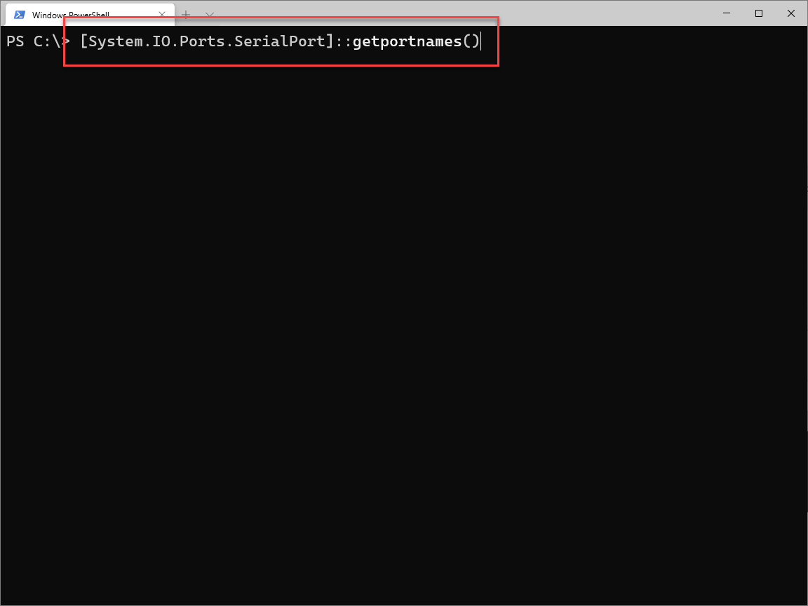
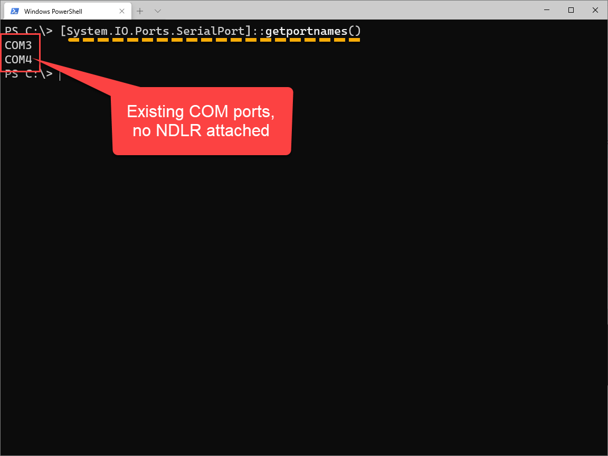
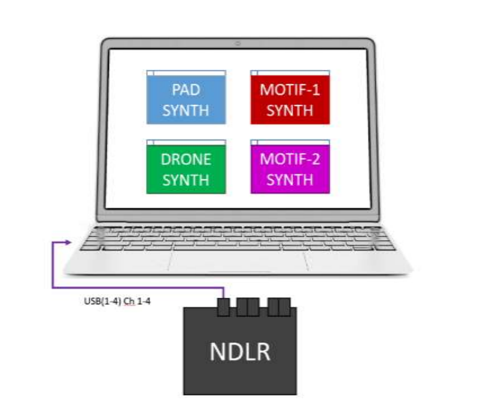
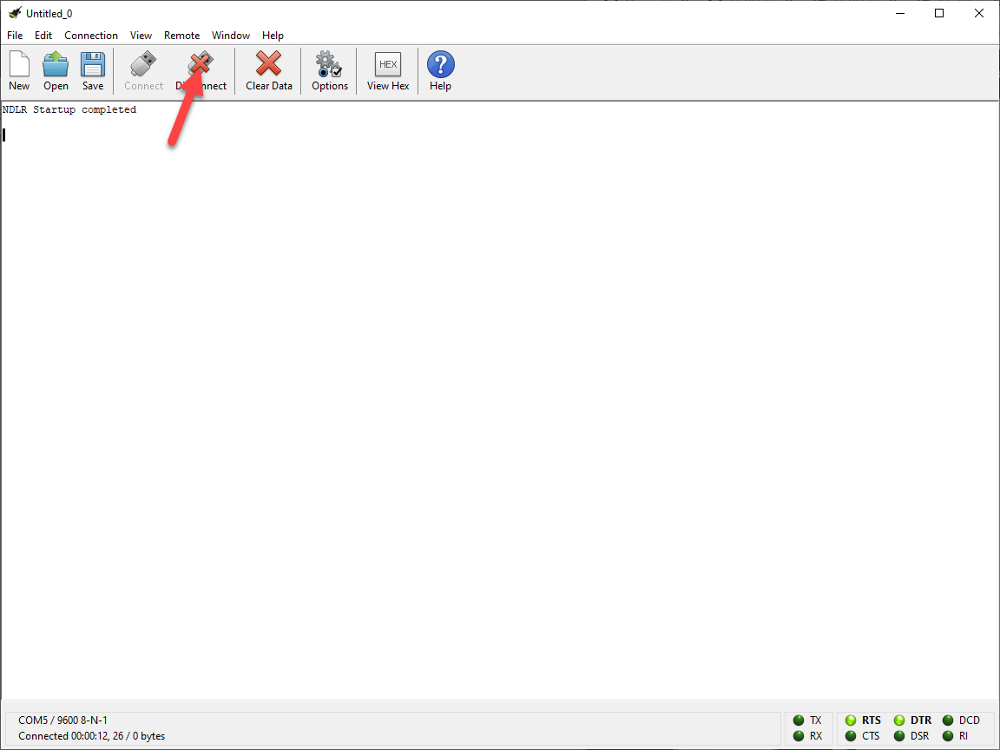

---
lab:
    title: 'Lab: Environment Setup'
    module: 'Module 01: Setup the NDLR'
---

# Lab Environment Setup

## Lab scenario

For those NDLR-ers who want to play around with the [NDLR Librarian](https://github.com/Barilium8/The-NDLR-Librarian) and talk to the NDLR over USB without having to install the [Cool Term](https://github.com/Barilium8/The-NDLR-Librarian/wiki/0) serial terminal program, I have created this [PowerShell script](/blob/main/Allfiles/Labs/01/Solution/NDLRUSBSerial.ps1) to get started. It isn't finished but it shows that you don't need install any program to communicate with your [NDLR](https://conductivelabs.com/).

## Objectives

After you complete this lab, you will be able to:

- Connect the NDLR and find out which COM port it is connected.
- Use Cool Term find Serial connection details.

## Lab Setup

- **Estimated Time**: 15 minutes

## Instructions

### Before you start

#### Sign in to the lab virtual machine

Sign in to your Windows 10 virtual machine (VM) by using the following credentials:

- Username: **Admin**
- Password: **Pa55w.rd**

> **Note**: On a Windows 10 machine, PowerShell and a Windows USB to Serial driver is already installed. The USB Serial driver is [installed automatically](https://docs.microsoft.com/en-us/windows-hardware/drivers/usbcon/usb-driver-installation-based-on-compatible-ids). 

#### Review the installed applications

Find the taskbar on your Windows 10 desktop. The taskbar contains the icons for the applications that you'll use in this lab:

- Microsoft Edge
- File Explorer
- Windows Terminal
- Visual Studio Code
- [Cool Term](https://github.com/Barilium8/The-NDLR-Librarian/wiki/0)

#### Setup Task

[Cool Term](https://www.freeware.the-meiers.org/) is a simple serial port terminal application (no terminal emulation) that is geared towards hobbyists and professionals with a need to exchange data with hardware connected to serial ports such as servo controllers, robotic kits, GPS receivers, microcontrollers, etc.

1. Visit https://www.freeware.the-meiers.org/ and download and install the latest version of **Cool Term** for your computer.

### Exercise 1: Connect the NDLR and find the COM port 

#### Task 1: Find available COM ports with PowerShell

**Before** connecting you NDLR, you need to retrieve the available COM ports and find out on which port your NDLR is listening.

1. On the taskbar, select the **Windows Terminal** icon.
1. Enter the following command, and then select Enter to to retrieve the available COM ports and find out on which port your NDLR is listening:

    ```PowerShell
    [System.IO.Ports.SerialPort]::getportnames()
    ```

    

    

    > **Note**: Make sure the NDLR is **not** attached to the computer.

#### Task 2: Connect the NDLR to the computer

1. Connect the NDLR with a USB cable to your computer.

    

2. Wait until the NDLR is booted.

#### Task 3: Make a connection with Cool Term

1. On the taskbar, select the **Cool Term** icon.

1. In Cool Term press **Connect**

    

1. When the NDLR is connected, select **options**

    

1. Make note of the **Serial Port Options**

    

1. Open Notepad and write down:

    1. portName: *COM[yourportnumber]*
    1. baudRate: 9600
    1. parity: None
    1. dataBits: 8
    1. stopBits: 1

#### Task 4: Disconnect the NDLR from Cool Term

1. In Cool Term select **disconnect** to disconnect the the NDLR.

    

    > **Note**: Make sure the NDLR is still connected to the computer. You only disconnect the connection in Cool Term. If Cool Term is still connected, you cannot make a connection with PowerShell.

#### Task 5: Find the NDLR COM port with PowerShell 

**After** connecting you NDLR, check the available COM ports again and find out on which port your NDLR is listening.

1. Switch to the **Windows Terminal**, enter the following command, and then select Enter to retrieve the available COM ports again:

    ```PowerShell
    [System.IO.Ports.SerialPort]::getportnames()
    ```

1. Make a note of the new COM port that appears. On my machine the NDLR is connected to **COM5**:

    

Now you know the connection details needed to communicate with PowerShell. Leave the NDLR connected to the computer and continue with the next exercise.