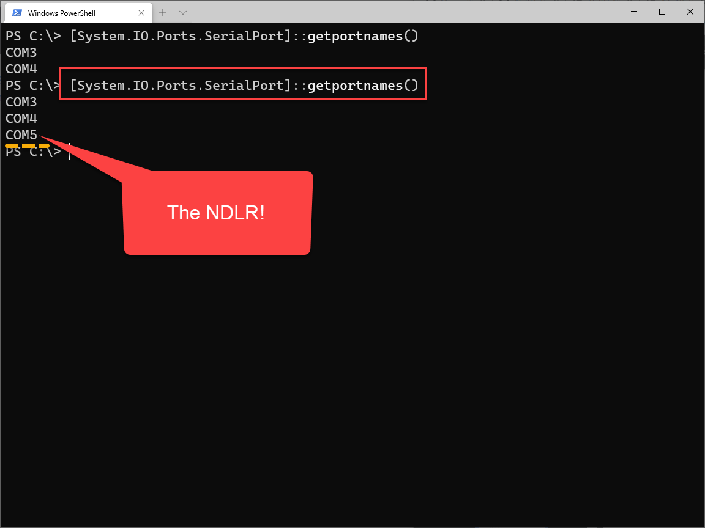

---
lab:
    title: 'Lab: Lab Environment Setup'
    module: 'Module 01: Setup'
---

# Lab Environment Setup
# Student lab answer key

## Lab scenario

For those NDLR-ers who want to play around with the [NDLR Librarian](https://github.com/Barilium8/The-NDLR-Librarian) and talk to the NDLR over USB without having to install the [Cool Term](https://github.com/Barilium8/The-NDLR-Librarian/wiki/0) serial terminal program, I have created this [PowerShell script](NDLRUSBSerial.ps1) to get started. It isn't finished but it shows that you don't need install any program to communicate with your [NDLR](https://conductivelabs.com/).
## Objectives

After you complete this lab, you will be able to:

- Communicate with the NDLR ovr Serial by PowerShell

## Lab Setup

  - **Estimated Time**: 15 minutes

## Instructions

### Before you start

#### Sign in to the lab virtual machine
Sign in to your Windows 10 virtual machine (VM) by using the following credentials:

- Username: **Admin**
- Password: **Pa55w.rd**

> **Note**: On a Windows 10 machine, PowerShell and a Windows USB to Serial driver is already installed. The USB Serial driver is [installed automatically](https://docs.microsoft.com/en-us/windows-hardware/drivers/usbcon/usb-driver-installation-based-on-compatible-ids). 

#### Review the installed applications

Find the taskbar on your Windows 10 desktop. The taskbar contains the icons for the applications that you'll use in this lab:

- Microsoft Edge
- File Explorer
- Windows Terminal
- Visual Studio Code
- [Cool Term](https://github.com/Barilium8/The-NDLR-Librarian/wiki/0)

#### Setup Task


## PowerShell 
[Writing and Reading info from Serial Ports](https://devblogs.microsoft.com/powershell/writing-and-reading-info-from-serial-ports/) with PowerShell is quite easy. After connecting the NDLR, you need to open the COM port, send a command to the NDLR and read the response.

As far as I know, there is no special Serial Port module to install. However you can use the .Net SerialPost Class and call it directly from PowerShell.

| Class/Enum/Method | Description |
| - | - |
| [SerialPort Class](https://docs.microsoft.com/en-us/dotnet/api/system.io.ports.serialport) | Represents a serial port resource |
| [Parity Enum](https://docs.microsoft.com/en-us/dotnet/api/system.io.ports.parity) | Specifies the parity bit for a SerialPort object |
| [StopBits Enum](https://docs.microsoft.com/en-us/dotnet/api/system.io.ports.stopbits) | Specifies the number of stop bits used on the SerialPort object |
| [ReadExisting](https://docs.microsoft.com/en-us/dotnet/api/system.io.ports.serialport.readexisting) | Specifies the number of stop bits used on the SerialPort object |
| [WriteLine](https://docs.microsoft.com/en-us/dotnet/api/system.io.ports.serialport.writeline) | Specifies the number of stop bits used on the SerialPort object |

> **Note**: The System.IO.Ports.SerialPort class is also available in [.Net Core](https://www.nuget.org/packages/System.IO.Ports/) so you can also try to run this script on Linux or a Mac.


### Exercise 1: Find available COM ports 

After connecting you NDLR, you need to retrieve the available COM ports and find out on which port your NDLR is listening. You can use this PowerShell command:
```
[System.IO.Ports.SerialPort]::getportnames()
```
On my machine it returns COM 5:


