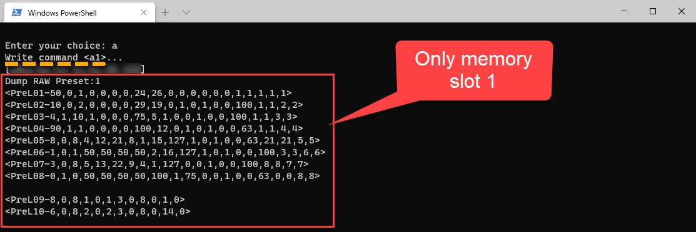

---
lab:
    title: 'Lab: All about Rhythms commands'
    module: 'Module 05: Rhytms'
---

# Lab Environment Setup
# Student lab answer key

## Lab scenario


## Objectives

After you complete this lab, you will be able to:

- @@

## Lab Setup

  - **Estimated Time**: 30 minutes

## Instructions

### Before you start

#### Sign in to the lab virtual machine
Sign in to your Windows 10 virtual machine (VM) by using the following credentials:

- Username: **Admin**
- Password: **Pa55w.rd**

> **Note**: On a Windows 10 machine, PowerShell and a Windows USB to Serial driver is already installed. The USB Serial driver is [installed automatically](https://docs.microsoft.com/en-us/windows-hardware/drivers/usbcon/usb-driver-installation-based-on-compatible-ids). 

#### Review the installed applications

Find the taskbar on your Windows 10 desktop. The taskbar contains the icons for the applications that you'll use in this lab:

- Microsoft Edge
- File Explorer
- Windows Terminal
- Visual Studio Code
- [Cool Term](https://github.com/Barilium8/The-NDLR-Librarian/wiki/0)

### Exercise 1: Patterns command

#### Task 1: Open the Serial Port

1. On the taskbar, select the **Windows Terminal** icon.
1. Enter the following commands, and then select Enter to open the connection to the NDLR:

    ```PowerShell
    # Receive all available COM ports
    # Make sure the NDLR is connected 
    [System.IO.Ports.SerialPort]::getportnames()

    # Needed variables
    $portName = "COM5"  # Change if needed
    $baudRate = 9600
    $parity = [system.io.ports.parity]::None
    $dataBits = 8
    $stopBits = [system.io.ports.stopbits]::One
    
    # Create a Serial Port object based on the given variables
    $port= new-Object System.IO.Ports.SerialPort $portName,$baudRate,$parity,$dataBits,$stopBits
    
    # Open the Serial port
    $port.Open()
    ```

    > **Note**: Make sure to change the name of the $portname if the Port Name is other the COM5.

1. Leave the Terminal open for the next task.

#### Task 2: Show NDLR Advanced settings Menu

If a wrong command is sent to the NDLR, it will respond with limited help information. 
   
1. Enter the following command, and then select Enter to show the **NDLR Advanced settings menu**:

    ```PowerShell
    $command = "?"
    $port.WriteLine($command)
    $port.ReadExisting()
    ```
    

#### Task 3: Dump All Presets

Use command **c** **to Dump All Presets**. 
  
1. Enter the following command, and then select Enter to show the **NDLR Advanced settings menu**:

    ```PowerShell
    $command = "?"
    $port.WriteLine($command)
    $port.ReadExisting()
    ```

      

#### Task 4: Dump All Raw Presets

In previous versions of the firmware, it was possible to Read the Raw data of All presets or a specific preset. The NDLR has 8 memory slots.
   
1. Enter the following command, and then select Enter to Read a preset from **all** of The NDLR memory slots:
 
   ```PowerShell
    $command = "<a>"
    $port.WriteLine($command)
    $port.ReadExisting()
    ```
 
   

#### Task 5: Dump a single Raw Presets

In previous versions of the firmware, it was possible to Read the Raw data of All presets or a specific preset. The NDLR has 8 memory slots.
   
1. Enter the following command, and then select Enter to Read the RAW preset data from NDLR memory slot **1**:
 
   ```PowerShell
    $command = "<a1>"
    $port.WriteLine($command)
    $port.ReadExisting()
    ```
 
   

#### Task 7: Disconnect
The Serial connection will be disconnected automatically when you close PowerShell. However to prevent the COM port to remain open, it is recommended to close the port.

1. Enter the following command, and then select Enter to close the COM port:

    ```PowerShell
    $port.Close()
    ```
 
   

1. Close all currently running instances of the **Windows Terminal** application.