# NLDRUserSerial script

## Getting Started

Copy the [NDLRUSBSerial script](/Allfiles/Labs/01/Solution/NDLRUSBSerial.ps1) to a local directory, open the directory in PowerShell and start the script:

```PowerShell
.\NDLRUSBSerial.ps1
```

## Main Menu

The menu starts with a small menu, disconnected:

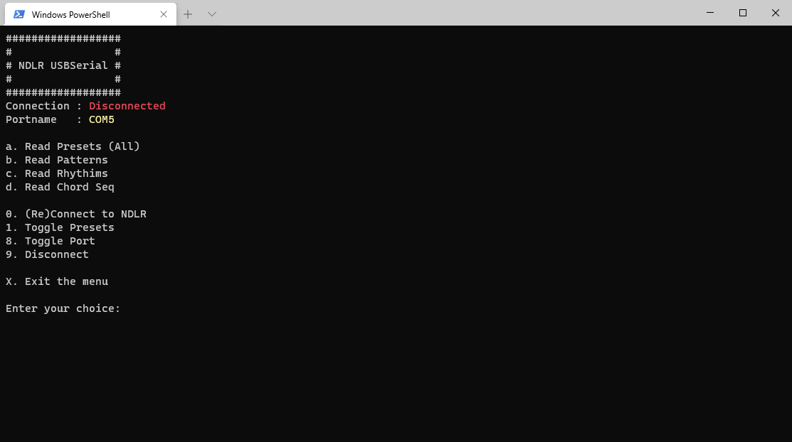

### 0) Connect to the NDLR

Use **0** connect to the NDLR. If you are already connected, you can always reconnect if something wrong occurs. Any open connection to the NDLR is closed before it tries to reconnect:

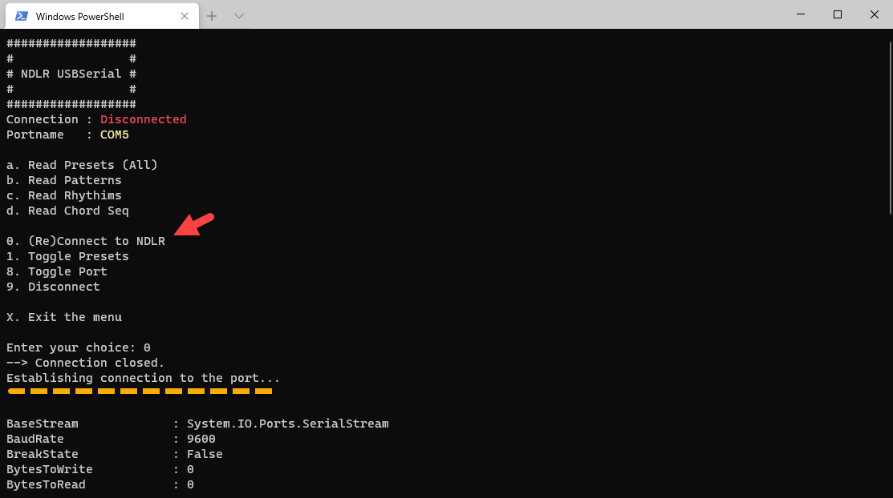

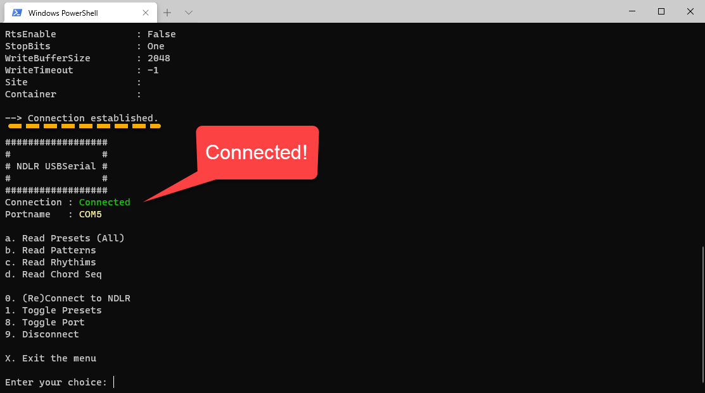

> **Note**: when you select 9 (disconnect) of x (exit) the connection will be closed. Don't use CTRL+C to end the script. The connection will remain open!

### a) Read Presets (All) or (1-8)

Use **1** to toggle between the Presets options. You can read all the memory slots at once or just a single memory slot. Make sure to select the right slot number (1-8):

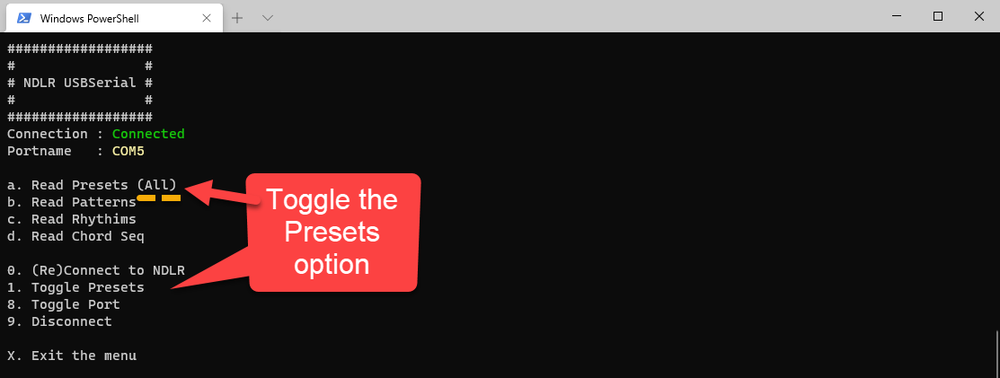

Presets (All) - All memory slots

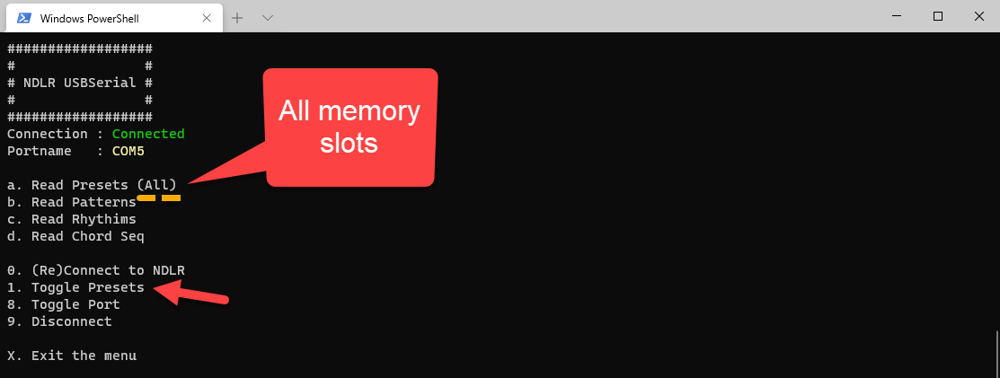

Present (1) - Memory Slot 1

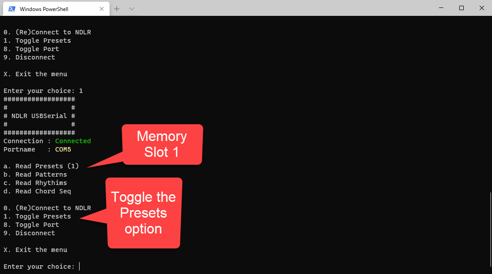

Use **a** to send the command to the NDLR and read the Preset results:

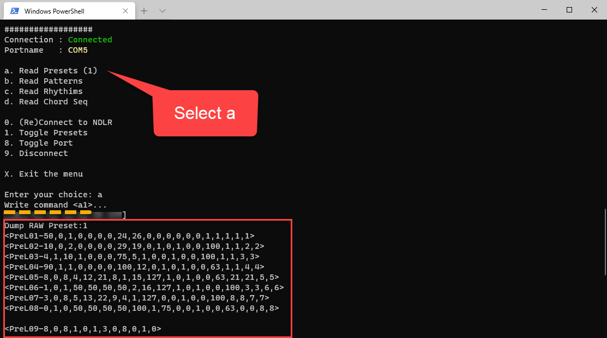

> **Note**: the command **\<a1\>** is send to the NDLR

### b) Read Patterns

Use **b** to send the command to the NDLR and read the Pattern results:

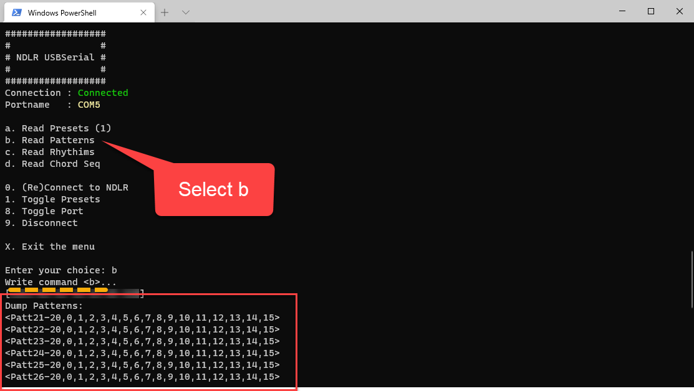

> **Note**: the command **\<b\>** is send to the NDLR

### c) Read Rhythms

Use **c** to send the command to the NDLR and read the Rhythm results:

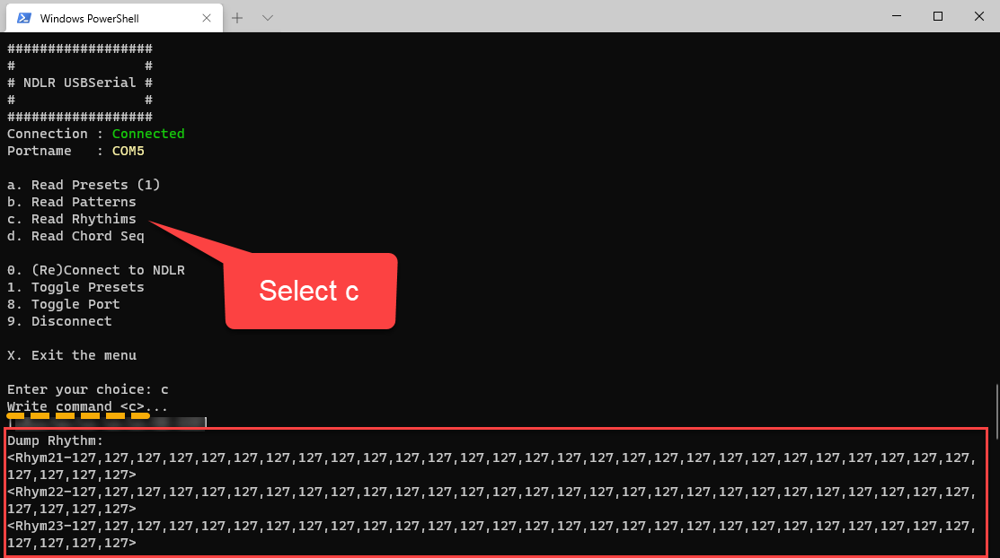

> **Note**: the command **\<c\>** is send to the NDLR

### d) Read Chord Seq

Use **d** to send the command to the NDLR and read the Chord Sequence results:


> **Note**: the command **\<d\>** is send to the NDLR

### 9) Disconnect

Use **9** to disconnect the connection to the NDLR:

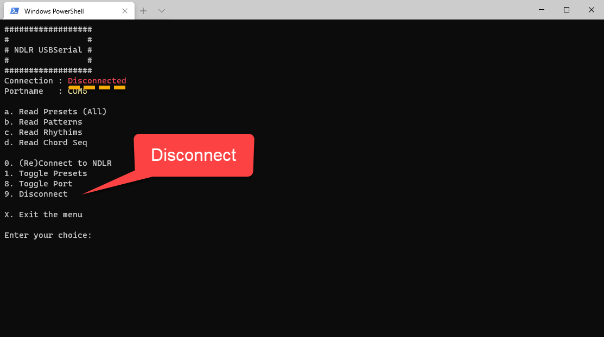

### x) Exit the menu

Use **x** to disconnect the connection to the NDLR and exit the script:

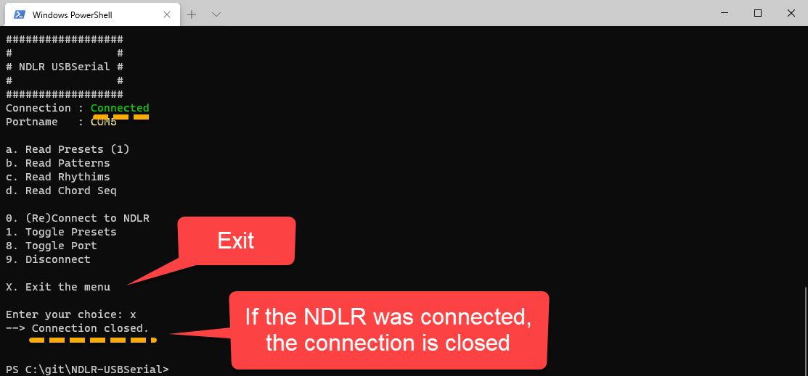

**Happy noodling!**
