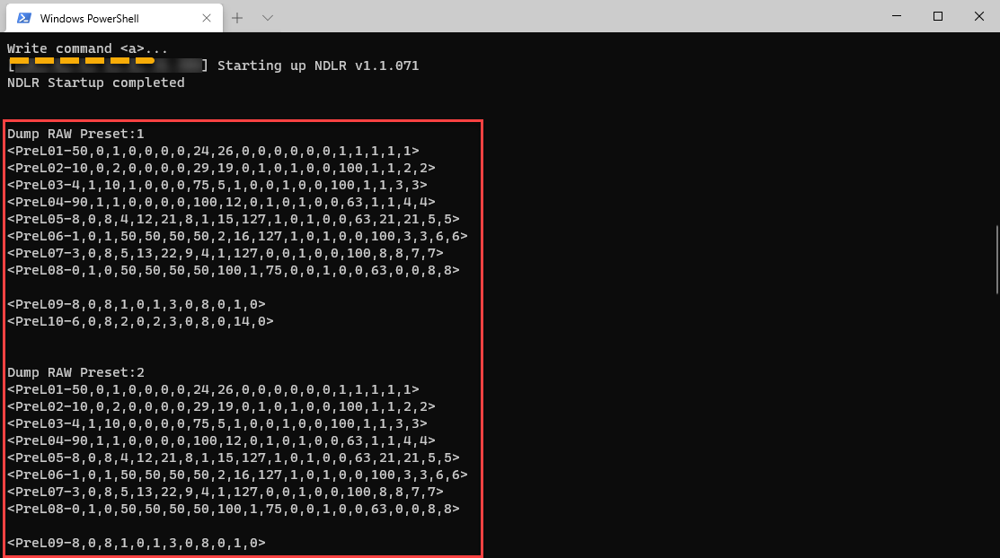
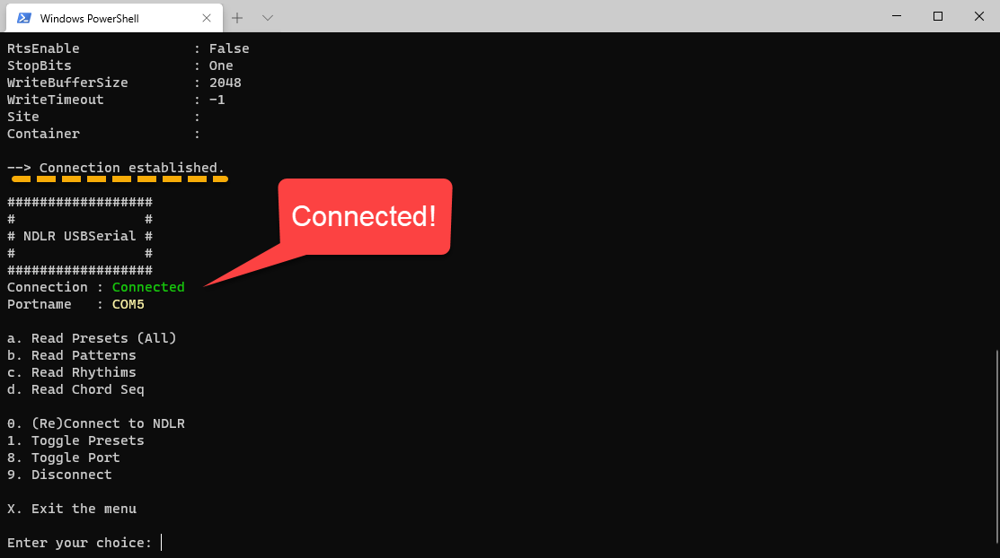
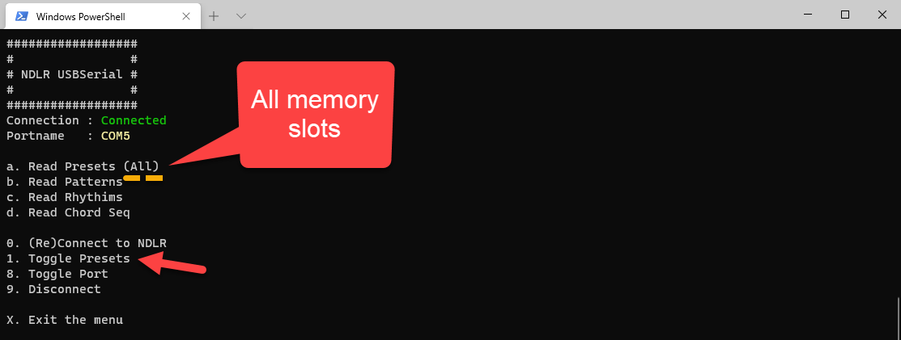
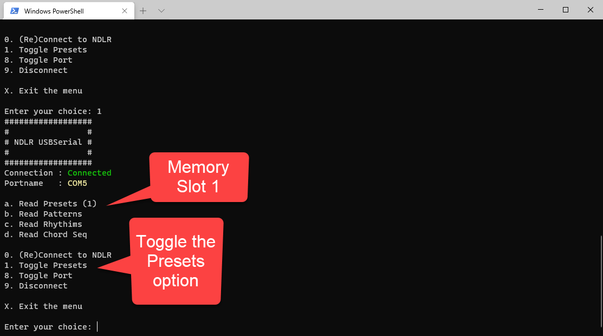
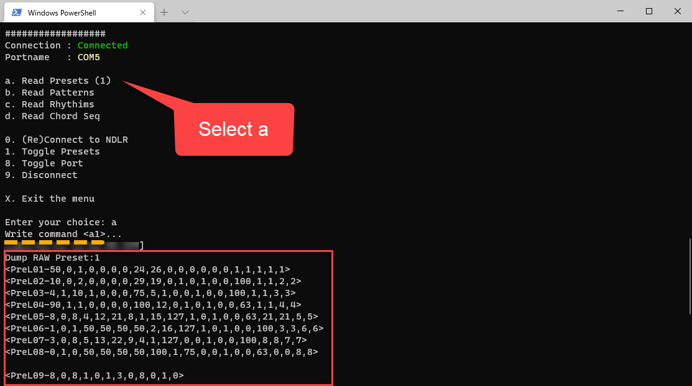
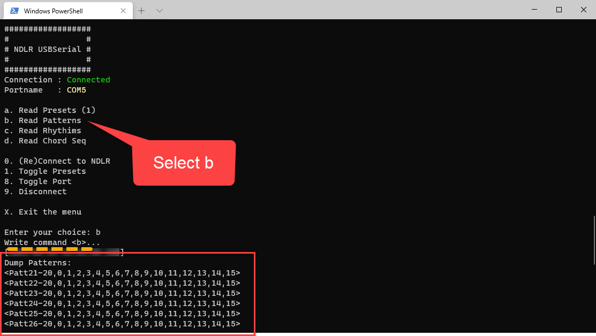
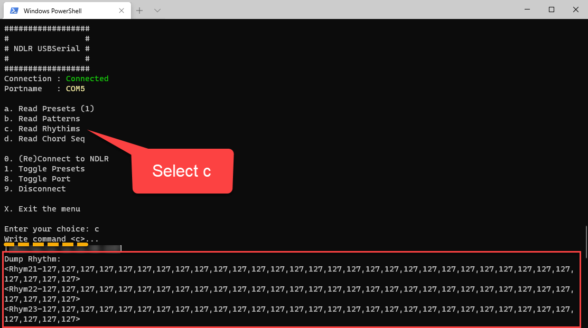
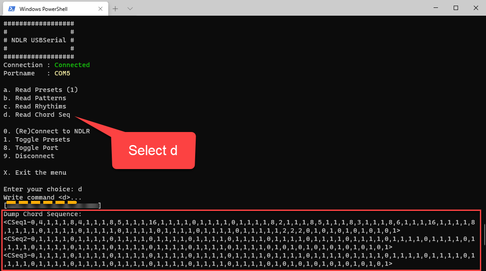

# NDLR-USBSerial

## Serial communication over USB to the NDLR with PowerShell

For those NDLR-ers who want to play around with the [NDLR Librarian](https://github.com/Barilium8/The-NDLR-Librarian) and talk to the NDLR over USB without having to install the [Cool Term](https://github.com/Barilium8/The-NDLR-Librarian/wiki/0) serial terminal program, I have created this [PowerShell script](/blob/main/Allfiles/Labs/01/Solution/NDLRUSBSerial.ps1) to get started. It shows that you don't need install any program to communicate with your [NDLR](https://conductivelabs.com/). 

I also created a [PowerShell mini course](https://marcelmolenaarittraining.github.io/NDLR-USBSerial) to get started. 

On a Windows 10 machine, PowerShell and a Windows USB to Serial driver is already installed. The USB Serial driver is [installed automatically](https://docs.microsoft.com/en-us/windows-hardware/drivers/usbcon/usb-driver-installation-based-on-compatible-ids).

## PowerShell 

[Writing and Reading info from Serial Ports](https://devblogs.microsoft.com/powershell/writing-and-reading-info-from-serial-ports/) with PowerShell is quite easy. After connecting the NDLR, you need to open the COM port, send a command to the NDLR and read the response.

As far as I know, there is no special Serial Port module to install. However you can use the .Net SerialPost Class and call it directly from PowerShell.

| Class/Enum/Method | Description |
| - | - |
| [SerialPort Class](https://docs.microsoft.com/en-us/dotnet/api/system.io.ports.serialport) | Represents a serial port resource |
| [Parity Enum](https://docs.microsoft.com/en-us/dotnet/api/system.io.ports.parity) | Specifies the parity bit for a SerialPort object |
| [StopBits Enum](https://docs.microsoft.com/en-us/dotnet/api/system.io.ports.stopbits) | Specifies the number of stop bits used on the SerialPort object |
| [ReadExisting](https://docs.microsoft.com/en-us/dotnet/api/system.io.ports.serialport.readexisting) | Specifies the number of stop bits used on the SerialPort object |
| [WriteLine](https://docs.microsoft.com/en-us/dotnet/api/system.io.ports.serialport.writeline) | Specifies the number of stop bits used on the SerialPort object |

> **Note**: The System.IO.Ports.SerialPort class is also available in [.Net Core](https://www.nuget.org/packages/System.IO.Ports/) so you can also try to run this script on Linux or a Mac.

## Find available COM ports

After connecting you NDLR, you need to retrieve the available COM ports and find out on which port your NDLR is listening. You can use this PowerShell command:

```PowerShell
[System.IO.Ports.SerialPort]::getportnames()
```

## Serial options

```PowerShell
$portName = "COM5"
$baudRate = 9600
$parity = [system.io.ports.parity]::None
$dataBits = 8
$stopBits = [system.io.ports.stopbits]::One
```
> **Note**: Make sure to use the [Parity Enum](https://docs.microsoft.com/en-us/dotnet/api/system.io.ports.parity) and [StopBits Enum](https://docs.microsoft.com/en-us/dotnet/api/system.io.ports.stopbits) Enums instead of a String.

## Open the Serial Port

```PowerShell
$port= new-Object System.IO.Ports.SerialPort $portName,$baudRate,$parity,$dataBits,$stopBits
$port.Open()
```

If have put that command with some logging to the console in a try catch block

# Write data

```PowerShell
$command = "text"
$port.WriteLine($command)
```

# Read data

```PowerShell
$port.ReadExisting()
```

# Examples

### Presets command - \<a\>

To Read a preset from **all** of The NDLR memory slots. The NDLR has 8 memory slots:

```PowerShell
$command = "<a>"
$port.WriteLine($command)
```



### Presets command - \<a1\>

To Read a preset from The NDLR memory slot 1:

```PowerShell
$command = "<a1>"
$port.WriteLine($command)
```

PowerShell:


# NLDRUserSerial script

## Getting Started

Copy the script to a local directory, open the directory in PowerShell and start the script:

```PowerShell
.\NDLRUSBSerial.ps1
```

## Main Menu

The menu starts with a small menu, disconnected:


### 0) Connect to the NDLR

Use **0** connect to the NDLR. If you are already connected, you can always reconnect if something wrong occurs. Any open connection to the NDLR is closed before it tries to reconnect:




> **Note**: when you select 9 (disconnect) of x (exit) the connection will be closed. Don't use CTRL+C to end the script. The connection will remain open!

### a) Read Presets (All) or (1-8)

Use **1** to toggle between the Presets options. You can read all the memory slots at once or just a single memory slot. Make sure to select the right slot number (1-8):


Presets (All) - All memory slots



Present (1) - Memory Slot 1



Use **a** to send the command to the NDLR and read the Preset results:



> **Note**: the command **\<a1\>** is send to the NDLR

### b) Read Patterns

Use **b** to send the command to the NDLR and read the Pattern results:



> **Note**: the command **\<b\>** is send to the NDLR

### c) Read Rhythms

Use **c** to send the command to the NDLR and read the Rhythm results:



> **Note**: the command **\<c\>** is send to the NDLR

### d) Read Chord Seq

Use **d** to send the command to the NDLR and read the Chord Sequence results:



> **Note**: the command **\<d\>** is send to the NDLR

### 9) Disconnect

Use **9** to disconnect the connection to the NDLR:


### x) Exit the menu

Use **x** to disconnect the connection to the NDLR and exit the script:


**Happy noodling!**
